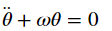

# Pendulo simple:
En esta actividad, se trabajó en la resolución a la ecuación diferencial de un péndulo simple:

* Primero elaboré un código "Plano" en donde hice uso de mis "skills" como programador y se llegó a una aproximación por el método Runge Kutta para un sistema de ecuaciones.
Usando ciclos y cosas de **Python** básico, sin usar nada de **Numpy** excepto el valor de pi y el coseno.

* Luego hice un código haciendo uso de arreglos de **Numpy** y aprovechando sus métodos y propiedades, el objetivo es comparar el tiempo de ejecución entre uno y otro, para ver cuál es más eficiente.

## Comparación entre tiempos, con arreglos Numpy y sin arreglos Numpy

**Observe la siguiente tabla de tiempos obtenida del código "Codigo_Plano.ipynb" y el código "Codigo_Numpy.ipynb"**

|                           | Numpy     | Plano     |
|---------------------------|-----------|-----------|
| Función Runge Kutta       | 8.97 ms   | 15.3 ms   |
| Extracción de información | 997 µs    | 1.13 ms   |
| Graficar la información   | 2 ms      | 998 µs    |
| Total                     | ‭11.967‬ ms | 17.428 ms |

Se evaluaron tres momentos dentro de ambos códigos, cuando se ejecuta la función Runge Kutta, cuando se extrae la información de los archivos creados por esta última y por último cuando se graficó y se sumaron los tiempos, es claro que manejar arreglos con Python es mucho más rápido y eficiente que hacerlo de manera "normal". Dentro de ambos notebooks, se encuentra el código, las gráficas y los tiempos que tardo el código en ejecutarse.

La diferencia no es muy grande (Es de microsegundos). Sin embargo, esto es porque se trabajó con una cantidad pequeña de datos, de 200 datos únicamente. Si imaginaramos trabajar con billones de datos (Es decir, datos reales), entonces tal vez habría diferencia de segundos, minutos, horas o incluso días y semanas. Numpy es claramente muy poderoso.
